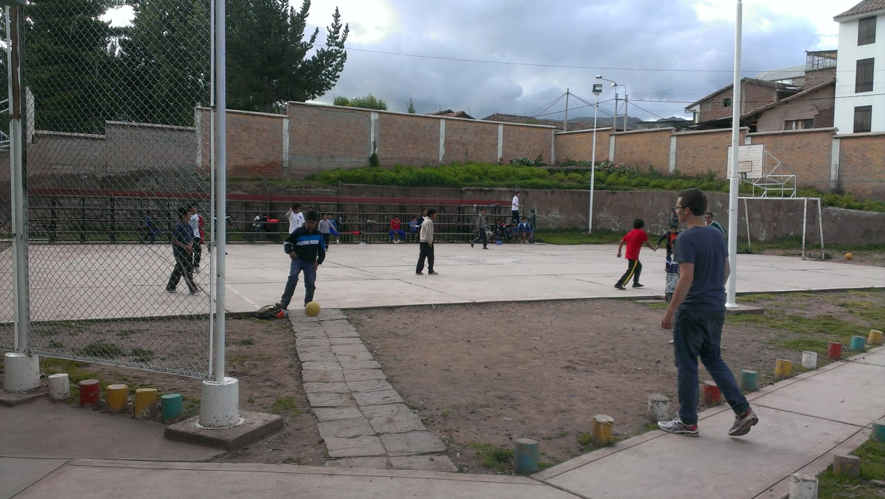

Terwijl ik dit schrijf zit ik in de Starbucks aan de Plaza de Armas, het hoofdplein van Cusco. Ieder zichzelf respecterend stadje in Peru heeft trouwens een Plaza de Armas in het centrum. Heel handig als je een stad nog niet kent, en toch met de taxi naar het centrum moet.
Er klinkt salsa muziek in het café, zoals hier overal, in ieder café en iedere auto, altijd salsa muziek klinkt.

Ik ben nu iets langer dan een maand hier. Mijn gastgezin is een week op reis naar Lima, dus laat ik nu iedere avond de hond uit (Coby – middelgroot, zwart krulhaar, lief maar rechtvaardig) en vlucht ik sporadisch naar cafés in het centrum voor het internet, aangezien alleen de afwezige familieleden weten waar de router met de wifiknop in mijn huis verstopt zit.

Het gaat goed hier in Peru: Spaans spreken gaat steeds beter, de gastfamilie is heel aardig, het weer is goed en wordt steeds beter (het einde van het regenseizoen nadert), en ik mag bijna beginnen met werken. Donderdag ben ik voor het eerst bij het project geweest, alleen om even kennis te maken en alvast rond te kijken. Maandag mag ik echt beginnen met werken. Het project is een weeshuis genaamd Hogar [Jesus mi Luz](http://mijnbestemmingperu.nl/vrijwilligerswerkperu/vrijwilligersprojecten/projectenmetkinderen/98-jesusmiluz.html) (alles is katholiek hier) waar zo’n vijftig jongens van negen tot vijftien jaar oud verblijven.

Op de kijkdag heb ik al heel even geholpen bij de Engelse les van een andere vrijwilliger. Een groepje van vier kinderen leerde over getallen, dieren en groentes, en ze waren erg enthousiast tijdens de les. Daarna werd er vooral veel gevoetbald (voetbal is zonder twijfel de nationale sport van Peru). Zowel de begeleiders als de jongens waren heel vriendelijk en ik was meteen beste amigos met een groepje van de jongere kinderen. Een van hen gaf me direct bij binnenkomst al twee vermoedelijk zelfgewoven armbanden, één bruin en één blauw, als _un regalo_ (een cadeau) voor mij, zijn _amigo_. De handdruk die ze me gaven moet ik nog even oefenen.

<figure>
	
	<figcaption>De jongens houden van voetbal.</figcaption>
</figure>

Engelse les, sport en spel (binnen en buiten) zal ik ook het meest gaan uitvoeren in het project. Zeker nu ik het zelf gezien hebt lijkt het me een heel mooi doel, en ik heb in ieder geval het gevoel dat de begeleiders en de kinderen erg blij met me zijn. Omdat de jongens in het huis een stabiele begeleiding nodig hebben, mag je er pas werken vanaf acht weken: ik ga er dus minstens acht weken werken, en misschien zelfs iets meer als het allemaal goed gaat.

Aankomende week gaat het project dus echt beginnen. Ik heb er erg veel zin in! Ergens volgende week zal ik jullie ook wat over de omgeving vertellen, en mijn foto’s van de trips die ik in en rondom Cusco heb gemaakt hier tentoonstellen.

Hasta pronto!