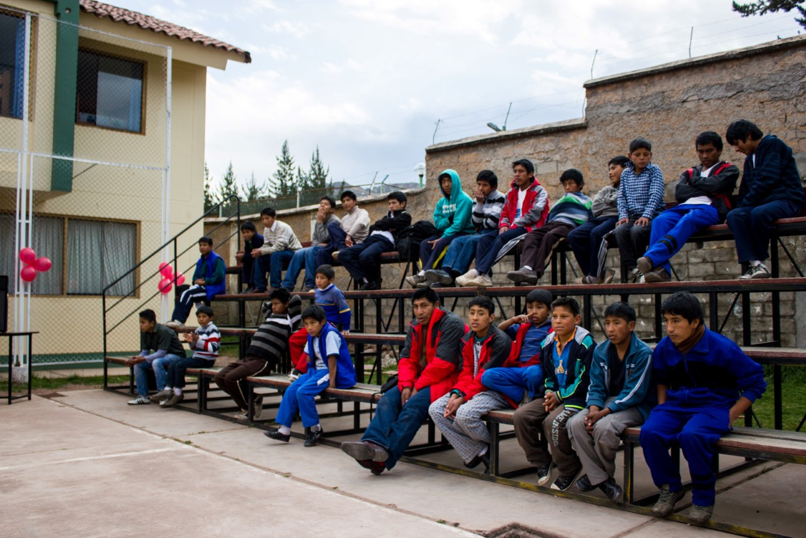

Het weeshuis waarin ik werk is redelijk groot. Qua formaat en voorzieningen, maar ook qua aantal kinderen. Er zijn achtenveertig jongens, alleen jongens, die iedere dag in het weeshuis doorbrengen. Van ’s ochtends tot ’s avonds is het weeshuis hun thuis. Eén dagdeel gaan ze wel naar een collegio, een plaats buiten de deur waar ze een normaal programma volgen aan een basisschool of middelbare school.

Het weeshuis heeft een hoofdgebouw met daarin een bibliotheek, een klaslokaaltje, een lokaal voor weefwerkzaamheden en een lokaal waar ze leren schoenmaken, en de kantoortjes van de mamita’s (de directie). Op de tweede verdieping zijn ook de slaapzalen. Kleine kinderen slapen bij de kleinen, grote bij de groten. Er is nog een ander gebouw waar de *comedor* (eetzaal) is, naast de keuken, en een groot algemeen klaslokaal erboven.

De jongens die wonen in het weeshuis komen uit allerlei verschillende plaatsen, vaak in de buurt van Cusco; minder vaak komen ze uit Cusco zelf. Om in het weeshuis opgenomen te mogen worden, moet een rechter beslissen dat het kind *abandonado* is: verlaten, en zonder enige mogelijkheid om ergens anders terecht te kunnen. Dit moet omdat het weeshuis een overheidsproject is. Dit is dan ook hoe het huis aan het meeste van zijn geld komt: van de overheid.

Vanaf acht jaar oud mag een jongen normaliter het weeshuis in, tot aan zijn achttiende levensjaar. Daarna wordt hij met financiële en sociale hulp “het echte leven” in gestuurd, en wordt hij voor nog een jaar gevolgd.

<figure>
	
	<figcaption>De jongens op de trap naast de speelplaats. Links een deel van het weeshuis.</figcaption>
</figure>

De kinderen komen soms naar het weeshuis omdat ze geen ouders hebben, maar vaker omdat ze slechte ouders hebben. Ouders die teveel drinken, ouders die ziek zijn en hun kinderen niet kunnen verzorgen, of ouders die hun kinderen mishandelen. Ook worden sommige gehandicapte kinderen in Peru niet even gemakkelijk geaccepteerd in een familie als in Nederland. Af en toe vraag ik één van de jongens naar hun achtergrond. Ik vind het altijd interessant om te horen, en naarmate ik ze beter ken voelt het niet meer ongemakkelijk om naar hun verhaal te vragen.

Een van de jongens in het weeshuis valt op omdat hij zijn arm altijd gedwongen in dezelfde positie houdt. Ook loopt het met één van zijn benen minder goed; het is een beetje gebogen, vervormd. Desalniettemin is hij net zo spraakzaam en brutaal als de rest van de groep. Ik help hem vaak met zijn huiswerk: lezen en schrijven (ook goed voor mijn Spaans) en simpel rekenen. Toen hij op een dag vroeg aan mij of ik broers en zussen heb, zag ik kans om door te vragen naar zijn eigen familie. Zijn ouders leven zeker nog, vertelde hij, maar ze drinken erg veel. Zelf probeerde hij ooit bier uit een flesje, op straat, toen hij twaalf jaar oud was (nu is hij niet veel ouder, schat ik). Hij vond het vies en heeft het sindsdien niet meer gedronken. Op een dag is hij uit huis gevlucht, in zijn eentje, weg van zijn ouders. Blijkbaar leek de situatie thuis voor hem erger dan de situatie op straat. Hij liet naast zijn ouders ook zijn broers en zussen achter. Van allen heeft hij tot op heden niemand meer gezien.

Daarna vroeg ik hem hoe hij aan zijn verminkte arm en been komt. Hij is een keer van de tweede verdieping van zijn huis gevallen, vertelde hij, en daar heeft hij het aan overgehouden. Wanneer of waarom vertelde hij niet. Dat is nu ook eigenlijk niet meer belangrijk: nu loopt, rent, springt, gooit en eet hij op zijn eigen manier. Anders is het niet. In Nederland was hij wellicht beter geholpen aan zijn verwondingen, bedacht ik mij nog.

De verhalen van de weeskinderen zijn allemaal heel verschillend. Met een andere jongen ben ik een keer in het centrum gaan wandelen, als beloning voor zijn eerste plaats in de huiswerkklas. We zijn met zijn tweeën naar het Inca museum geweest, hebben door de stad gelopen en ijs gegeten. Hij luisterde naar mijn iPod – een grappig gezicht, de koptelefoon was veel te groot voor zijn hoofd – en probeerde foto’s te maken met mijn toestel. Het is een hele vrolijke jongen, en een van de betere kleine vrienden die ik heb gemaakt onder de bijna vijftig jongens. Ik gok dat hij zo’n elf jaar is.

Hij vertelde mij dat hij uit *la selva* komt: uit “het bos”. Zijn dorp Quillabamba is een redelijk bekende plaats op zo’n 6 uur rijden van Cusco. Het ligt een stuk lager dan Cusco, en mede daarom ook veel dichter bij het beboste gebied. In Quillabamba groeien ze ook koffiebonen en cacao. Soms noemen de andere kinderen deze jongen spottend *monito*, wat letterlijk aapje betekent. Bijnamen zijn in het weeshuis en in heel Peru normaler dan we in Nederland gewend zijn. Toen ik vroeg naar zijn familie, vertelde hij mij dat hij nog vier broers en zussen heeft. Allen jonge kinderen. Zijn ouders leven nog. Ik vroeg hem hoe hij in het weeshuis terecht is gekomen. Net als veel anderen is hij gevlucht uit zijn eigen huis, weg van zijn familie. Ik heb geen idee hoe hij op zichzelf in Cusco terecht is gekomen.

“Waarom ging je weg?”, vroeg ik hem.

“Mijn ouders zijn jong”, zei hij, “en mijn vader sloeg ons.”

Ik dacht even na over het volgende wat ik zou kunnen zeggen. Blijkbaar was zijn vader dermate slecht dat het huis uit vluchten de beste optie was.

“En je moeder? Hoe was zij?”

“Goed, lief, maar mijn vader sloeg haar ook.”

Hij praatte zonder veel moeite verder over zijn ouders; voor hem leek het heel normaal. Ik vroeg hem of zijn ouders of broers en zussen hem weleens bezoeken in het weeshuis. Hij vertelde mij van niet: hij heeft geen van allen meer gezien sinds zijn vertrek.

“Mis je je broers en zussen dan niet af en toe?”, vroeg ik.

“Jawel, vaak.” Hij knikte lachend.

“En wat doe je dan, als je ze mist?”

“Niets.”

Hij sprak de waarheid als een kind, een harde waarheid verteld met een grote glimlach.

Het zou niet moeilijk zijn om het weeshuis iedere dag in lichte shock te verlaten. Vraag elke dag een kind naar zijn achtergrond en je hoort de ergste dingen. Dit doe ik dus ook maar niet.

Na verloop van tijd zie ik steeds meer hoe het weeshuis daadwerkelijk functioneert als het vervangende thuis van de jongens. Het biedt niet alleen een plaats om te leven, maar ook *mamita’s* en *profe’s* die eigenlijk fungeren als “moeders” en “vaders” van alle kinderen. De kinderen zijn net zo goed elkaars broers als vrienden: ze spelen en vechten alsof ze familie zijn. Ze eten samen, helpen elkaar en slapen in dezelfde kamers. De grote waarde hiervan wordt mij pas echt duidelijk nu ik er voor langere tijd heb gewerkt en de geschiedenis (en in brede zin ook de toekomst) van de jongens begin te kennen. Het is hun echte thuis, hun familie: een onmisbare vervanging van de mensen die nu missen uit hun leven.